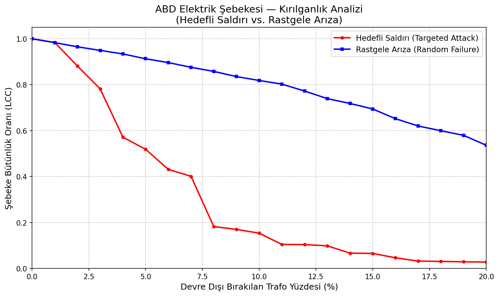

# Elektrik Şebekelerinde Kırılganlık ve Kritik Altyapı Analizi


Bu proje, Ege Üniversitesi Bilgisayar Mühendisliği Yüksek Lisans Programı **"Çizge Teorisinde Ölçüm Parametreleri"** dersi kapsamında, **elektrik dağıtım ve iletim şebekelerinin topolojik kırılganlıklarını** analiz etmek amacıyla geliştirilmiştir. Şebeke operasyonları ve veri biliminin kesişiminde yer alan bu çalışma, fiziksel sistemlerin siber-fiziksel zafiyetlerini proaktif olarak tespit etmeyi hedefler.

## Projenin Amacı ve Kapsamı

Modern elektrik şebekelerini **Çizge Teorisi (Graph Theory)** kullanarak modelliyor, ağ üzerindeki zafiyetleri, kaskad (zincirleme) arıza potansiyellerini ve sistemin belkemiğini oluşturan kritik altyapı düğümlerini algoritmik olarak tespit ediyoruz.

Proje iki fazdan oluşmaktadır:

### Faz 1 — Ağ Analizi
* **Arasındalık Merkeziliği (Betweenness Centrality):** Şebeke üzerindeki güç akışında darboğaz (bottleneck) yaratabilecek en kritik trafo merkezlerinin tespiti.
* **En Büyük Bağlı Bileşen (Largest Connected Component - LCC):** Ağın fiziksel bütünlüğünün ölçülmesi.

### Faz 2 — Arıza Simülasyonu ve Görselleştirme
* **Hedefli Saldırı Simülasyonu (Targeted Attack):** BC skorlarına göre en kritik düğümlerden başlayarak ağdan düğüm çıkarma ve LCC değişimini izleme.
* **Rastgele Arıza Simülasyonu (Random Failure):** Rastgele düğüm çıkarma ile şebekenin doğal arızalara dayanıklılığını ölçme.
* **Kırılganlık Eğrisi (Vulnerability Curve):** İki senaryonun karşılaştırmalı görselleştirmesi.

## Veri Seti (Dataset)

Projede, Duncan Watts ve Steven Strogatz'ın çalışmalarında da yer alan, ABD Batı Yakası yüksek gerilim iletim şebekesini topolojik olarak modelleyen açık kaynaklı `power-US-Grid` veri seti kullanılmaktadır.

| Özellik | Değer |
|---|---|
| Düğüm Sayısı (Trafo Merkezleri) | 4.941 |
| Kenar Sayısı (İletim Hatları) | 6.594 |
| Ortalama Derece | 2.67 |
| Ağ Yoğunluğu | 0.000540 |
| Bağlı Bileşen Sayısı | 1 |
| Format | Matrix Market (.mtx) |


*(Veri Seti İstatistikleri — Kaynak: Network Repository)*

## Deneysel Sonuçlar

Aşağıdaki grafik, hedefli saldırı ve rastgele arıza senaryolarının şebeke bütünlüğü üzerindeki etkisini karşılaştırmaktadır:



**Temel Bulgular:**

* **Hedefli saldırıda** yalnızca **%8** düğüm çıkarıldığında LCC oranı **0.18'e** düşer — şebekenin %82'si izole olur (kaskad çöküşü).
* **Rastgele arızada** ise **%20** düğüm çıkarıldığında bile LCC oranı **0.54** seviyesinde kalır — ağ çok daha dayanıklıdır.
* Bu fark, şebekenin **ölçeksiz (scale-free) ağ** özelliklerini taşıdığını gösterir.

## Proje Yapısı

```
MPGT_Project_Files/
├── data/
│   └── power-US-Grid/
│       └── power-US-Grid.mtx         # Veri seti (Matrix Market)
├── docs/
│   ├── vulnerability_curve.png        # Çıktı: Kırılganlık eğrisi grafiği
│   └── US-Grid_Network_Data_Statistics.png
├── src/
│   └── power_grid_analysis.py         # Ana analiz kodu (modüler, 8 fonksiyon)
├── requirements.txt
├── LICENSE
└── README.md
```

### Modüler Fonksiyon Yapısı

| # | Fonksiyon | Faz | Görevi |
|---|-----------|-----|--------|
| 1 | `load_power_grid()` | 1 | MTX/kenar listesi formatında veri yükleme |
| 2 | `print_network_summary()` | 1 | Temel ağ metriklerini yazdırma |
| 3 | `calculate_betweenness_centrality()` | 1 | Arasındalık Merkeziliği hesaplama |
| 4 | `print_top_critical_nodes()` | 1 | En kritik N düğümü listeleme |
| 5 | `calculate_lcc_size()` | 1 | LCC boyutu hesaplama |
| 6 | `simulate_targeted_attack()` | 2 | Hedefli saldırı simülasyonu |
| 7 | `simulate_random_failure()` | 2 | Rastgele arıza simülasyonu (çoklu deneme) |
| 8 | `plot_vulnerability_curve()` | 2 | Kırılganlık eğrisi görselleştirme |

## Kurulum ve Kullanım

**1. Repoyu Klonlayın:**
```bash
git clone https://github.com/hakkikeman/mpgt-power-grid-analysis.git
cd mpgt-power-grid-analysis
```

**2. Sanal Ortam Oluşturun (Önerilen):**
```bash
python -m venv .venv
.venv\Scripts\activate        # Windows
# source .venv/bin/activate   # macOS/Linux
```

**3. Gereksinimleri Yükleyin:**
```bash
pip install -r requirements.txt
```

**4. Çalıştırın:**
```bash
python src/power_grid_analysis.py
```

**Özel veri seti yolu belirtmek için:**
```bash
python src/power_grid_analysis.py --data path/to/your/dataset.mtx
```

## Teknoloji Yığını

| Araç | Kullanım Amacı |
|---|---|
| **Python 3.10+** | Ana programlama dili |
| **NetworkX** | Çizge oluşturma, metrik hesaplama, bileşen analizi |
| **SciPy** | Matrix Market formatı okuma |
| **Matplotlib** | Kırılganlık eğrisi görselleştirme |

## Lisans

Bu proje [MIT Lisansı](LICENSE) ile lisanslanmıştır.